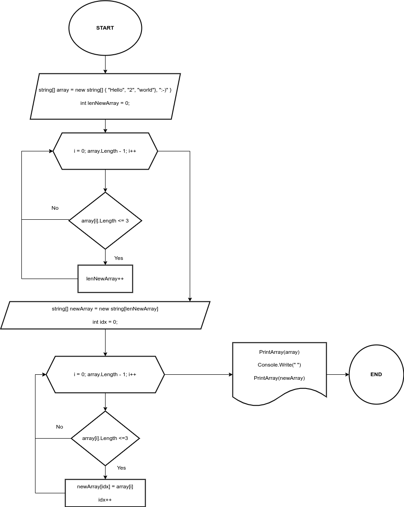
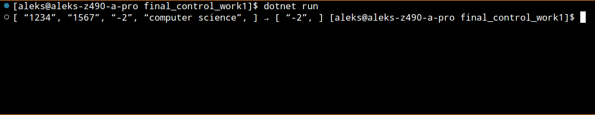
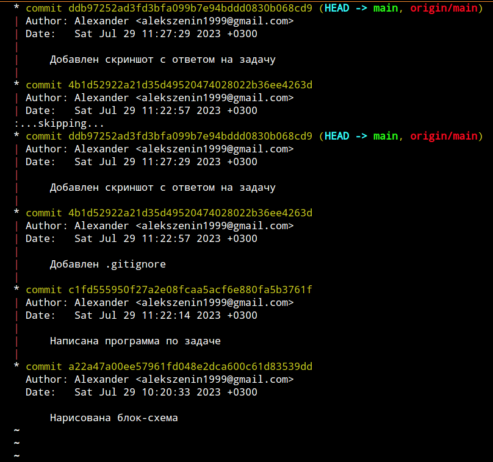

# Итоговая контрольная работа по основному блоку
## **Условия задачи**

Задача алгоритмически не самая сложная, однако для полноценного выполнения проверочной работы необходимо:

1. Создать репозиторий на __GitHub__
2. Нарисовать блок-схему алгоритма _(можно обойтись блок-схемой основной содержательной части, если вы выделяете её в отдельный метод)_
3. Снабдить репозиторий оформленным текстовым описанием решения _(файл __README.md__)_
4. Написать программу, решающую поставленную задачу
5. Использовать контроль версий в работе над этим небольшим проектом _(не должно быть так, что всё залито одним коммитом, как минимум этапы 2, 3, и 4 должны быть расположены в разных коммитах)_

**Задача:**

Написать программу, которая из имеющегося массива строк формирует новый массив из строк, длина которых меньше, либо равна 3 символам. Первоначальный массив можно ввести с клавиатуры, либо задать на старте выполнения алгоритма. При решении не рекомендуется пользоваться коллекциями, лучше обойтись исключительно массивами.

**Примеры:**
```
[“Hello”, “2”, “world”, “:-)”] → [“2”, “:-)”]
[“1234”, “1567”, “-2”, “computer science”] → [“-2”]
[“Russia”, “Denmark”, “Kazan”] → []
```
***

## **Решение**
1. Вы находитесь в созданном репозитории `final_control_work1`.
2. Блок-схема алгоритма:
> 

3. Вы читаете данный фаил `README.md`
4. Программа находится в ветке [`main`](Program.cs "Открыть решение")

Код программы:
```cs
string[] FirstArray = new string[] { "1234", "1567", "-2", "computer science" };

PrintArray(FirstArray);
Console.Write("→ ");
PrintArray(NewArray());

string[] NewArray()
{
    int lenNewArray = 0;
    for (int i = 0; i <= FirstArray.Length - 1; i++)
    {
        if (FirstArray[i].Length <= 3) lenNewArray++;
    }

    string[] newArray = new string[lenNewArray];
    int idx = 0;

    for (int i = 0; i <= FirstArray.Length - 1; i++)
    {
        if (FirstArray[i].Length <= 3)
        {
            newArray[idx] = FirstArray[i];
            idx++;
        }
    }
    return newArray;
}

void PrintArray(string[] array)
{
    Console.Write("[ ");
    for (int i = 0; i < array.Length; i++)
    {
        Console.Write($"“{array[i]}”, ");
    }
    Console.Write("] ");
}
```

Результат вывода в терминал:

> 

5. Скриншот коммитов для подтверждения.

>